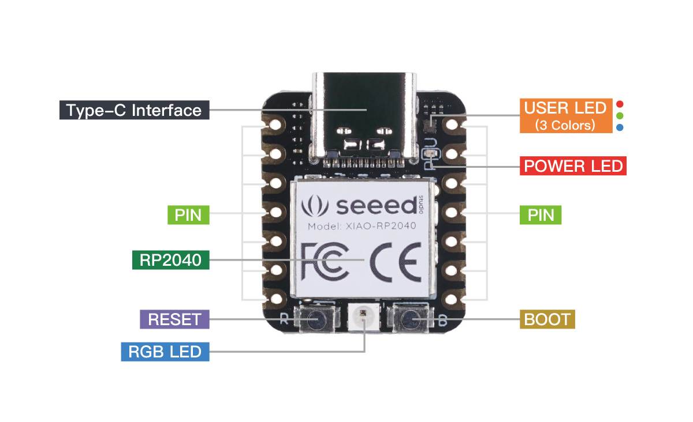

# Hack Uncertainty for fun and profit

Uncertainty's firmware is open-source and easy to swap with a humble USB-C cable. You can write your own firmware in C++, MicroPython, CircuitPython, and probably a bunch of other languages. It's startlingly easy to work and this document will outline the whole deal. Let's go…

## Uncertainty’s Heart

We’re working with the mighty RP2040, a dual-core 133 MHz arm processor that is just a silly amount of power for outputting gates. Heck, you can easily overclock to over 300 MHz. Really hoping people make some messed up things.

## Uncertainty’s I/O

- one CV input that can recognize signals -5v to +5v (resolution is functionally close to 10-bit, so there probably isn’t quite the precision for v/oct)
- eight +5v gate outputs that each have their own LED (if you turn on the gate, you turn on the LED; they can’t be decoupled)
- a three pin I2C connector (this feature is experimental and largely untested)

To access this I/O use the following pins. You can use other pins, but they won’t work. I don’t know why you’d use other pins. Use these pins:


|        | Pin # |
| ------ | ------ |
|CV input|26|
|Gate 1|27|
|Gate 2|28|
|Gate 3|29|
|Gate 4|0|
|Gate 5|3|
|Gate 6|4|
|Gate 7|2|
|Gate 8|1|
|I2C SDA|6|
|I2C SCL|7|

## Lets’s write a simple utility in MicroPython!

We’re going to turn Uncertainty into a device where you send it a voltage to select which of the 8 gates is active. Only one will be active at a time. 0v will activate the first gate. As you move towards -5v or +5v it switches to higher and highter gates, until it gets to gate 8.

### Getting set up

If we were using C we’d write our code in Arduino, but for MicroPython the easiest thing seems to be Thonny. So grab that and launch it. Now connect your Uncertainty to your computer over USB-C while holding down the boot button with the little B on it.



You should see RPI-RP2 on your desktop and Thonny should prompt you to install MicroPython onto the device. Do it. Just do it. Now Thonny can talk to Uncertainty whenever you plug in USB-C without holding down the boot button.

### Coding the code
These two lines import everything we need to deal get CV in and Gates out:

```python
import time
from machine import Pin, ADC
```

But our code doesn’t know which pin on the RP2040 is the CV in and which are the gates out. So let’s just set up a few variables:

```python
cv_in = ADC(Pin(26))
outs = [Pin(27, Pin.OUT),
        Pin(28, Pin.OUT),
        Pin(29, Pin.OUT),
        Pin(0, Pin.OUT),
        Pin(3, Pin.OUT),
        Pin(4, Pin.OUT),
        Pin(2, Pin.OUT),
        Pin(1, Pin.OUT)]
```

Now let’s make “the loop”. This is all we need to get a chunk of code to run a thousand times a second:

```python
while True:

    # your code here

    time.sleep(0.001)
```

For the actual logic we only need to do three things. (1) Figure out which gate should be active, (2) make it active, and (3) turn off the others.

1. CV comes in as a 16-bit number so we need to scale and offset it to convert the number of the active step:

    ```active_gate = abs(int((cv_in.read_u16() - 32768) / 4096))```

2. To make a gate active we give it a value of 1:

    ```outs[active_gate].value(1)```

3. Now we look through each gate and if it’s not the active one, we turn it off by passing in a value of 0:

```python
    for num in range (8):
        if num != active_gate:
            outs[num].value(0)
```

Now let’s bring this all together and look at the final code:

```python
import time
from machine import Pin, ADC

cv_in = ADC(Pin(26))
outs = [Pin(27, Pin.OUT),
        Pin(28, Pin.OUT),
        Pin(29, Pin.OUT),
        Pin(0, Pin.OUT),
        Pin(3, Pin.OUT),
        Pin(4, Pin.OUT),
        Pin(2, Pin.OUT),
        Pin(1, Pin.OUT)]

while True:

    active_gate = abs(int((cv_in.read_u16() - 32768) / 4096))

    for num in range (8):
        if num != active_gate:
            outs[num].value(0)

    outs[active_gate].value(1)

    time.sleep(0.0001)
```

That’s it. That’s a module, baby. A baby module. Done.

## How to reinstall the default firmware

You hold down the boot button when you plug in the USB-C as described in the *Getting started* section. Then you drag ```uncertainty.uf2``` onto the RPI-RP2 disk. It should then unmount. All set! The same works for any .uf2 firmware.
